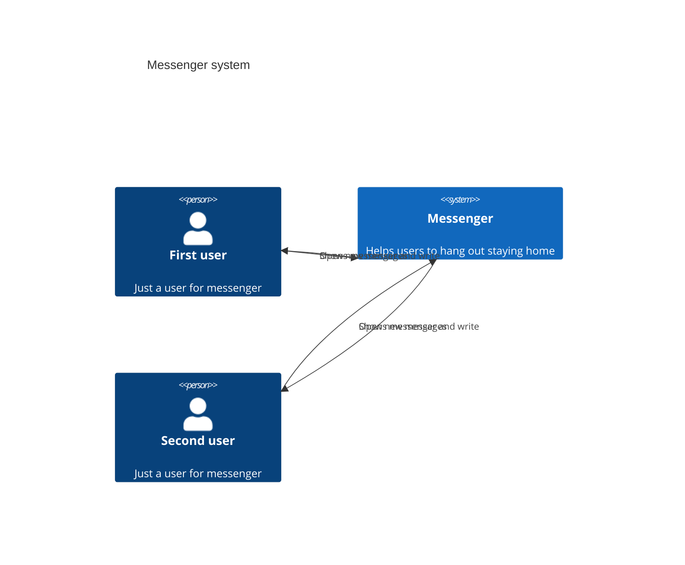

# Messenger without GUI
This is my final project of OTUS courses.

## Description
The messenger consists of two applications: server and client.
Server listens on localhost:8080. To change the configuration, you need to change `/src/common/infrastructure/ServerSettings.h`

## Build
First of all need to install all dependencies
This step will be useless after including docker container for development.
```bash
sudo apt update
sudo apt upgrade
sudo apt-get update
sudo apt-get install libboost-all-dev -y
sudo apt-get install protobuf-compiler -y
sudo apt-get install libgtest-dev -y
sudo apt-get install libgmock-dev -y
```

```bash
cd src/`
mkdir build
cd build
cmake ../
cmake --build ./
```
After that in build dir will be two applications: `client` and `server`, and some tests.

## Utils
For more comfortable work with code style and coding convention was written script `run_clang_format.sh`

## Architecture

C4 context
