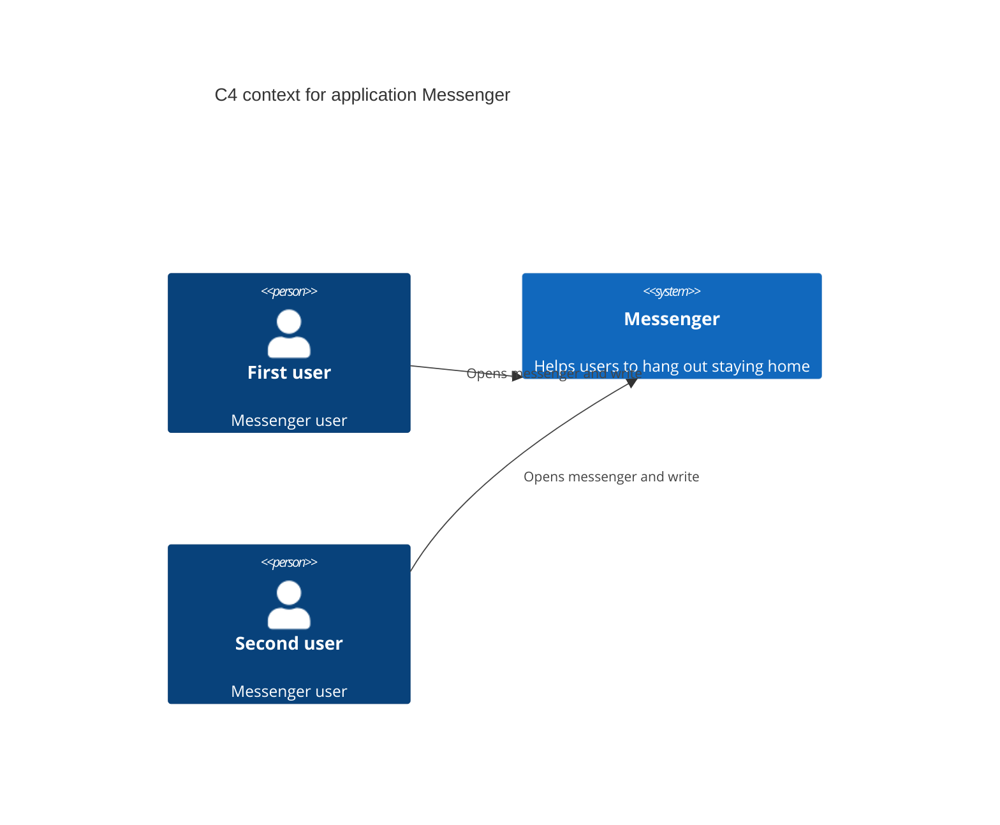
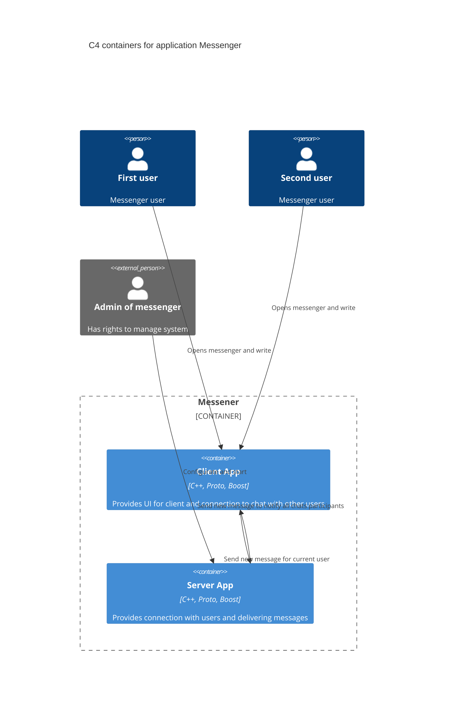

# Messenger without GUI
This is my final project of OTUS courses.

## Description
The messenger consists of two applications: server and client.
Server listens on localhost:8080. To change the configuration, you need to change `/src/common/infrastructure/ServerSettings.h`

## Build

For build you need to install Docker

After set bin directory
```bash
export PATH=~/Projects/desktop_releaser/bin:$PATH
source ~/.bashrc
```

Run for build
```bash
messenger-build.sh
```

Run for build and run tests
```bash
messenger-build-and-run-test.sh
```

After that in `src/build` dir will be two applications: `client` and `server`, and some tests.

## Utils
For more comfortable work with code style and coding convention was written script `run_clang_format.sh`

## Architecture



